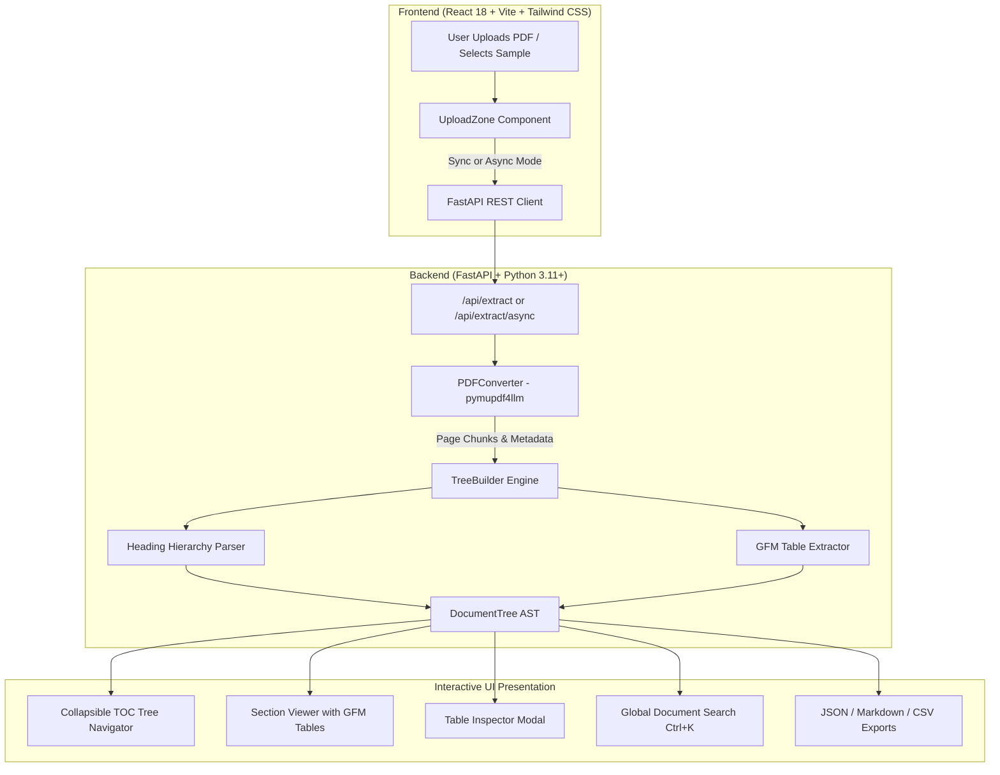

# 📑 DocExtractor AI — Hierarchical PDF Structure & Table Extraction Platform

An intelligent document structure extraction platform that parses complex, multi-page PDFs (100+ pages, mixed portrait/landscape orientations, and borderless tables) into navigable heading hierarchies and clean structured tables using `pymupdf4llm`, FastAPI, and React.

---

## 🌟 Architectural Highlights

- **⚡ Core Engine (`pymupdf4llm`)**: Layout-aware conversion of multi-page PDFs directly into Markdown with precise font-weight heading detection and borderless table recovery.
- **🌳 Navigable Heading Tree Hierarchy**: Automatically parses Markdown headings (`#` H1 $\rightarrow$ `##` H2 $\rightarrow$ `###` H3...) into parent-child tree nodes with start/end page boundaries, word counts, and isolated table objects.
- **📊 Embedded Table Extraction & Inspection**: Identifies GFM tables inside sections, providing full-screen inspection, column sorting, live row filtering, one-click clipboard copying, and CSV export.
- **🚀 Dual-Mode Processing Pipeline**:
  - *Synchronous Fast Extraction* (`/api/extract`): Immediate processing for smaller documents.
  - *Asynchronous Background Worker* (`/api/extract/async` + `/api/jobs/{job_id}`): Queued non-blocking processing for 100+ page documents without HTTP timeout limits.
- **🔍 Global Full-Document Search (`Ctrl+K`)**: Instant search across all section titles and body markdown with context snippets and direct navigation.
- **📥 Multi-Format Exporters**: One-click download as Hierarchical Tree (JSON), Layout-Clean Markdown (`.md`), or Detected Tables (`.csv`).

---

## 🏗️ System Architecture



---

## 🛠️ Technology Stack

| Layer | Technologies | Purpose |
|---|---|---|
| **Frontend** | React 18, Vite 6, Tailwind CSS, Lucide React, React Markdown, Remark GFM | Interactive glassmorphic UI, collapsible TOC tree, Markdown viewer, table inspector |
| **API Backend** | FastAPI, Uvicorn, Pydantic v2, Python-Multipart | High-throughput async REST API with sync & background job endpoints |
| **Extraction Engine** | `pymupdf4llm`, `PyMuPDF` (`fitz`), Tabulate | Layout analysis, font-based heading detection, borderless table parsing |

---

## 📂 Project Structure

```
DocExtractor-AI/
├── api/
│   ├── __init__.py
│   ├── main.py              # FastAPI server, endpoints (/api/extract, /api/jobs, /api/samples)
│   ├── models.py            # Pydantic schemas (DocumentTree, SectionNode, TableData, JobStatus)
│   └── job_manager.py       # In-memory async job queue & task runner for large PDFs
├── extraction/
│   ├── __init__.py
│   ├── converter.py         # pymupdf4llm wrapper with page chunking & metadata
│   └── tree_builder.py      # Markdown AST parser to build nested heading hierarchy tree
├── frontend/
│   ├── package.json         # React 18, Vite 6, Tailwind CSS, Lucide React, React Markdown
│   ├── tailwind.config.js   # Tailwind theme configuration
│   ├── vite.config.js       # Vite dev server with /api proxy
│   └── src/
│       ├── App.jsx          # Main application orchestrator & state manager
│       ├── index.css        # Tailwind directives & custom GFM markdown styles
│       └── components/
│           ├── Header.jsx           # Top navbar, document stats, export dropdown
│           ├── UploadZone.jsx       # Drag & drop upload area, sample selector, progress bar
│           ├── TocTree.jsx          # Collapsible/expandable heading tree navigator
│           ├── SectionViewer.jsx    # Rendered section content, breadcrumbs, table previews
│           ├── TableViewer.jsx      # Dedicated table inspector with sorting, search & CSV export
│           ├── SearchModal.jsx      # Global document search modal (Ctrl+K)
│           └── DocSummary.jsx       # High-level document overview metrics
├── tests/
│   ├── test_api.py          # FastAPI endpoint integration tests
│   ├── test_tree_builder.py # Unit tests for heading hierarchy and table parsing
│   └── sample_pdfs/         # Bundled sample PDFs for 1-click test drive
└── requirements.txt         # Backend Python dependencies
```

---

## 🚀 Getting Started

### 1. Prerequisites
- Python 3.10+
- Node.js 18+ and npm

### 2. Backend Setup
```bash
# Install Python dependencies
pip install -r requirements.txt

# Start FastAPI server (runs on http://127.0.0.1:8000)
python -m uvicorn api.main:app --port 8000 --reload
```

### 3. Frontend Setup
```bash
# Navigate to frontend directory
cd frontend

# Install Node dependencies
npm install

# Start Vite development server (runs on http://127.0.0.1:5173)
npm run dev
```

### 4. Running Tests
```bash
python -m pytest tests/ -v
```

---

## 📜 License
MIT License.
