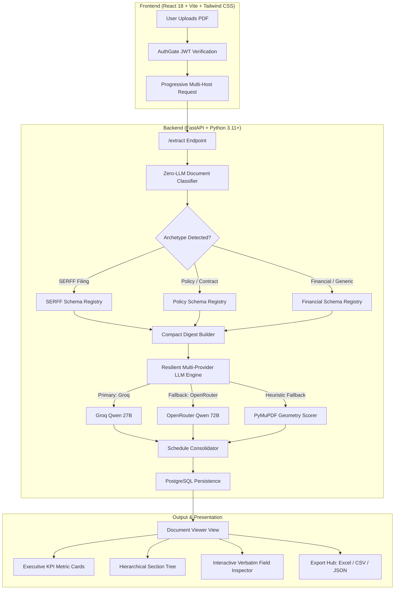
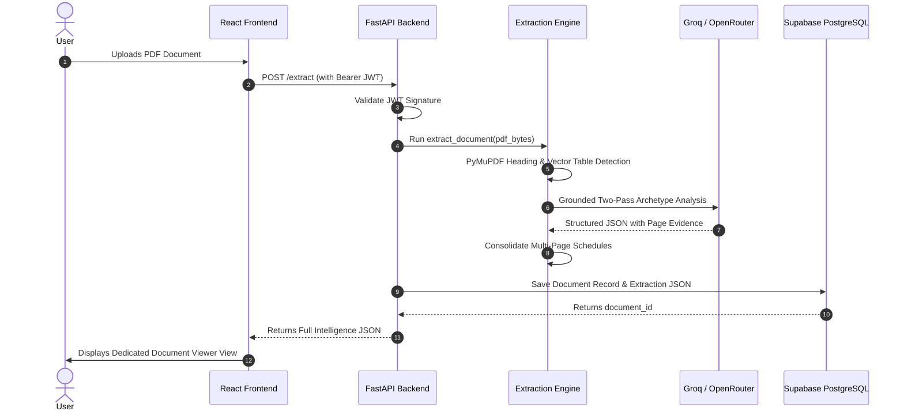

# 📑 DocExtractor AI — Enterprise Document Intelligence & Extraction Platform

An enterprise-grade, zero-hallucination document intelligence and extraction platform that transforms complex, multi-page PDFs (SERFF insurance filings, policy contracts, financial statements, and multi-column schedules) into structured, type-aware JSON, interactive visual hierarchies, clean CSVs, and formatted multi-sheet Excel workbooks.

---

## 🌟 Architectural Highlights

- **🎯 Zero-Hallucination Anti-Hallucination Contract**: Every extracted data point is strictly bound to its verbatim source page citation (`📍 p.1`). Missing values explicitly render factual `"⚠ Not found in document"` placeholders rather than fabricated values.
- **⚡ High-Speed Inference with Resilient Fallback**: Primary sub-second inference powered by Groq (`qwen/qwen3.8-27b`) with automatic failover to OpenRouter (`qwen-2.5-72b-instruct`) and PyMuPDF heuristics.
- **📊 Master Schedule Consolidation**: Automatically aggregates multi-page repeating tables, landscape schedules, and supporting document listings across hundreds of pages into consolidated master tables.
- **📗 Formatted Multi-Sheet Excel Export (`.xlsx`)**: One-click native workbook generation where each extracted table is organized into a dedicated worksheet with metadata columns cleanly sanitized.
- **🔒 Enterprise JWT & PostgreSQL Persistence**: Authenticated via Supabase ES256/HS256 JWTs with extraction histories stored in PostgreSQL.

---

## 🏗️ System Architecture & Workflow



---

## 🛠️ Technology Stack

| Layer | Technologies | Purpose |
|---|---|---|
| **Frontend** | React 18, Vite 5, Tailwind CSS, SheetJS (`xlsx`) | Responsive glassmorphic UI, live search, multi-sheet Excel generation |
| **Authentication** | Supabase Auth (ES256 JWKS & HS256 JWT) | Secure user registration, persistent sessions, token validation |
| **API Backend** | FastAPI, Uvicorn, Pydantic v2 | High-throughput async REST API, OpenAPI 3.0 docs |
| **Database** | Supabase PostgreSQL | Relational persistence for documents and extraction structures |
| **AI Inference** | Groq API, OpenRouter API | High-speed LLM inference with automated failover |
| **PDF Extraction Engine** | PyMuPDF (`fitz`), Regex Layout Heuristics | Vector table parsing, bounding box layout analysis, boilerplate elimination |

---

## 📂 Project Structure

```
DocExtractor-AI/
├── api/
│   ├── auth.py                  # Supabase ES256/HS256 JWT validation layer
│   ├── db.py                    # PostgreSQL database access layer with UUID guards
│   ├── main.py                  # FastAPI server with /extract, /documents endpoints
│   ├── models.py                # Pydantic schemas for API inputs and outputs
│   └── requirements.txt         # Backend Python dependencies
├── extraction/
│   ├── document_classifier.py   # Zero-LLM regex archetype classifier
│   ├── field_parser.py          # Verbatim key-value field extraction
│   ├── heading_detector.py      # Multi-factor visual heading scoring heuristics
│   ├── llm_client.py            # Resilient Groq & OpenRouter multi-provider client
│   ├── llm_extractor.py         # Grounded two-pass extraction with page citations
│   ├── parser.py                # Unified extraction pipeline entrypoint
│   ├── schedule_consolidator.py # Multi-page vector table consolidation
│   └── schema_registry.py       # Strict archetype schemas & anti-hallucination contracts
├── frontend/
│   ├── src/
│   │   ├── components/
│   │   │   ├── AuthGate.jsx       # Luxury glassmorphic auth wrapper
│   │   │   ├── Dashboard.jsx      # Document Vault with instant reload & delete
│   │   │   ├── DocumentViewer.jsx # Dedicated extraction intelligence viewer & export hub
│   │   │   ├── FieldTable.jsx     # Type-aware structured field table with one-click copy
│   │   │   ├── KpiStrip.jsx       # Dynamic metric cards (Currency, Dates, Statuses)
│   │   │   ├── Login.jsx          # Polished sign-in card
│   │   │   ├── Navbar.jsx         # Header bar with live status and sign-out
│   │   │   ├── SectionNode.jsx    # Collapsible hierarchical section nodes
│   │   │   ├── SectionTree.jsx    # Hierarchical tree container with live filtering
│   │   │   ├── Signup.jsx         # Polished account registration card
│   │   │   ├── SummaryCard.jsx    # Executive overview & verified highlights
│   │   │   └── TableView.jsx      # Paginated type-aware table renderer
│   │   ├── App.jsx              # Main dual-view application flow
│   │   └── lib/supabaseClient.js # Supabase client initialization
│   ├── package.json             # Frontend dependencies (React, Vite, XLSX)
│   └── vite.config.js           # Vite dev server with proxy
├── tests/
│   ├── test_parser.py           # Automated unit and visual tree test suite
│   └── sample_pdfs/             # Test document samples
├── requirements.txt             # Root Python dependencies
└── README.md                    # Project documentation
```

---

## ⚙️ Quick Start Guide

### Prerequisites
- **Python 3.10+**
- **Node.js 18+** and `npm`
- **Supabase Account** (URL, Anon Key, Service Role Key, JWT Secret)
- **Groq API Key** (or OpenRouter API Key)

---

### 1. Environment Setup

Create a `.env` file in the project root:

```env
# Supabase Configuration
SUPABASE_URL=https://your-project.supabase.co
SUPABASE_SERVICE_KEY=your-supabase-service-role-key
SUPABASE_JWT_SECRET=your-supabase-jwt-secret

# Primary LLM Provider: Groq
GROQ_API_KEY=gsk_your_groq_api_key
GROQ_MODEL=qwen/qwen3.8-27b

# Fallback LLM Provider: OpenRouter
OPENROUTER_API_KEY=sk-or-v1-your_openrouter_api_key
OPENROUTER_MODEL=qwen/qwen-2.5-72b-instruct
```

Configure `frontend/.env`:

```env
VITE_API_URL=http://localhost:8000
VITE_SUPABASE_URL=https://your-project.supabase.co
VITE_SUPABASE_ANON_KEY=your-supabase-anon-public-key
```

---

### 2. Backend Startup

```bash
# 1. Install Python dependencies
pip install -r requirements.txt

# 2. Start the FastAPI backend
python -m uvicorn api.main:app --host 0.0.0.0 --port 8000 --reload
```
API Documentation will be available at **[http://localhost:8000/docs](http://localhost:8000/docs)**.

---

### 3. Frontend Startup

```bash
# 1. Navigate to frontend directory
cd frontend

# 2. Install dependencies (including xlsx)
npm install

# 3. Start Vite development server
npm run dev
```
Open **[http://localhost:5180](http://localhost:5180)** in your browser.

---

## 📊 Extraction Flow & Capabilities



---

## 🧪 Testing & Verification

Run the automated test suite across sample PDFs:

```bash
# Run pytest with formatted hierarchical visual trees
pytest -v -s
```

---

## 📄 License & Compliance

This project is licensed under the MIT License. Designed for high-compliance environments requiring strict data fidelity and zero AI hallucinations.
